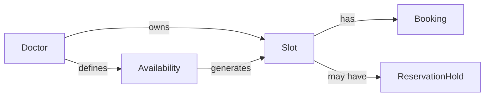
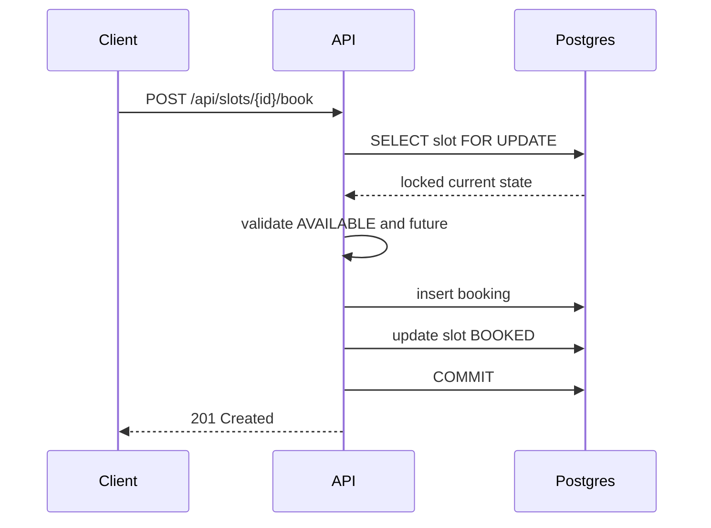

# Clinzo doctor-slot scheduling service

A production-oriented Spring Boot 3 / Java 21 backend for scheduling online consultations. The API stores every appointment timestamp as UTC (`Instant`) and presents slots in the doctor's configured IANA timezone.

## Architecture

The application is layered deliberately: controllers contain HTTP concerns, services own transactional business invariants, repositories perform persistence, and MapStruct maps entities to API responses. Flyway owns the PostgreSQL schema; Hibernate validates it rather than creating it.





## Concurrency strategy

`BookingService` runs booking, cancellation, and rescheduling in database transactions. Booking locks the slot row with JPA `PESSIMISTIC_WRITE` (`SELECT ... FOR UPDATE`), checks it is still `AVAILABLE`, creates the booking, and marks the slot `BOOKED` before commit. The unique `bookings.slot_id` constraint is a separate final guardrail. Rescheduling locks both slots in ascending ID order to avoid deadlocks, then releases and books atomically.

The `BookingConcurrencyIntegrationTest` launches 100 simultaneous attempts against PostgreSQL and asserts exactly one succeeds.

## API

Swagger UI: `http://localhost:8080/swagger-ui.html` (OpenAPI JSON: `/api-docs`).

| Method | Path | Purpose |
|---|---|---|
| POST | `/api/doctors` | Create doctor |
| GET | `/api/doctors` | List doctors |
| POST/PUT/DELETE | `/api/availability[/id]` | Manage availability |
| POST | `/api/availability/{id}/generate-slots` | Generate future slots |
| GET | `/api/doctors/{doctorId}/slots?date=YYYY-MM-DD` | Available slots in doctor timezone |
| POST | `/api/slots/{slotId}/book` | Atomically book a slot |
| POST | `/api/slots/{slotId}/hold` | Hold for two minutes |
| POST | `/api/bookings/{id}/cancel` | Cancel and release slot |
| POST | `/api/bookings/{id}/reschedule` | Atomically move booking |

## Run

Requires Java 21 and Gradle 8.10+ for a local build.

```bash
docker compose up --build
docker compose down
gradle test
```

The integration test needs a running Docker daemon because it uses Testcontainers PostgreSQL.

## Behaviour and assumptions

- Availability is local wall-clock time in the doctor's timezone. Generated slot boundaries are converted to UTC immediately.
- Incomplete trailing intervals are not generated; buffer is applied after each appointment.
- Editing/deleting availability never invalidates bookings. Future free/held slots are blocked and regenerated; booked slots survive.
- Holds transition `AVAILABLE -> HELD`; the scheduler expires them to `AVAILABLE` every 30 seconds. A future extension should associate holds with an authenticated patient/session before allowing a held slot to be booked.
- Overlapping active availability windows are rejected at the service layer. Production deployments should also use an exclusion constraint if they expose direct database writes.

## Scale and future work

The design scales safely across application instances because locking is in PostgreSQL, not JVM memory. Indexes support slot discovery and hold cleanup. For higher throughput, add a Redis read cache with slot-change invalidation, an outbox/Kafka publisher for booking events, tenant/doctor authorization, idempotency keys, rate limiting, a waitlist, and variable-duration/multi-doctor search APIs.
